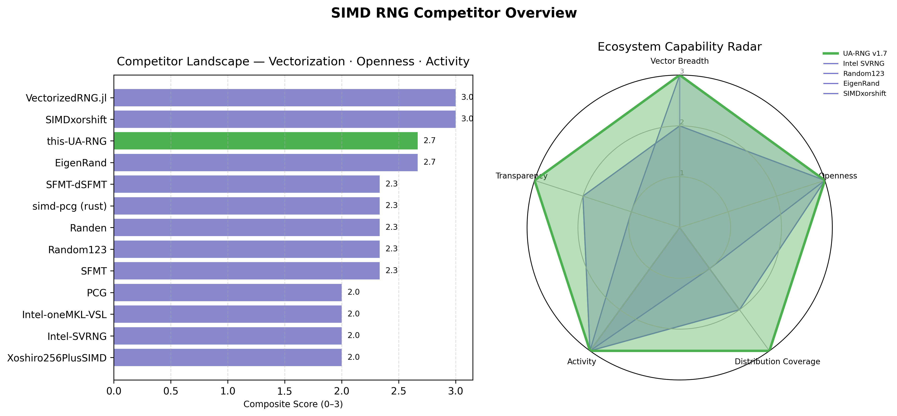

[README.md]

# benchmark

<p align="center">
  <a href="https://github.com/whisprer/benchmark/releases"> 
     
  </a>
  <a href="https://github.com/whisprer/benchmark/actions"> 
     
  </a>
</p>

 
 
 
[](https://github.com/whisprer/benchmark) 
[](https://www.microsoft.com/windows)
[](https://www.python.org)
[](LICENSE)

<p align="center">
  
</p>

Visual Summary

Left panel: Quantifies “market position” by combining vector depth, openness, and activity.
→ UA-RNG v1.7 sits at the top with the only full (3/3) composite rating.

Right panel: Radar chart compares structural capability profiles.
→ UA-RNG’s polygon covers every axis — the most balanced and complete project in the field.
→ Intel SVRNG spikes hard on vector breadth but collapses on openness and transparency.

_A high-precision visualization and analytics toolkit for multi-compiler, multi-OS RNG performance benchmarking._

---

## Overview

This project provides a **clean, extensible, and publication-grade benchmarking dashboard** for analyzing SIMD-optimized RNG performance across compilers and operating systems.

It consolidates CSV results, calculates throughput and variance deltas, and exports clear visual and tabular reports for cross-comparison.

### Core Highlights

- 🧮 **2×2 Multi-Panel Dashboard** — U64/F64 throughput, Speedup %, Δ-Variance
- 📊 **Automatic Baseline Comparison** — relative % improvement over a reference compiler
- 🧾 **Aligned Markdown Reports** — perfect ASCII tables for GitHub or terminal use
- 📈 **Top-3 LaTeX Export** — ready for paper or report inclusion
- 🧠 **No LaTeX dependency** — pure Matplotlib PDF backend
- ⚙️ **Consistent Cross-Platform Results** — stable across Linux, Windows, and MSYS2 builds

---

## Installation

```bash
python -m venv venv
source venv/bin/activate
pip install -r requirements.txt
```

Usage
```
python plot-cross-platform-adv.py \
  --baseline windows-msvc \
  --multi-panel \
  --top3-table \
  --style paper \
  --output results/cross_compiler_full_report.pdf
```

Optional Flags
```
Flag	Description
--baseline	Reference platform for relative % speedups
--multi-panel	Enables 2×2 composite plot layout
--top3-table	Exports results/top3_table.tex
--style	Choose paper (default) or dark theme
--output	Specify output file path
```

Directory Structure
```
simd-bench-visualizer/
├── plot-cross-platform-adv.py      # Main script
├── requirements.txt                # Dependencies
├── results/
│   ├── bench_all_linux-gcc.csv
│   ├── bench_all_windows-msvc.csv
│   ├── cross_compiler_full_report.pdf
│   ├── cross_compiler_full_report_all_comparisons_pretty.md
│   └── top3_table.tex
├── CHANGELOG.md
├── CONTRIBUTING.md
├── CODE_OF_CONDUCT.md
├── SECURITY.md
├── LICENSE
└── README.md
```

Example Output
```
Multi-Panel Dashboard

U64 & F64 throughput per generator

Speedup vs baseline

Δ Variance (%)

ASCII Table Example
+------------------+------------------------+------------------------+------------------------+----------------+
| Generator        | linux-gcc Read (Mops/s) | windows-msvc Read (Mops/s) | Winner                 | Advantage (%) |
+------------------+------------------------+------------------------+------------------------+----------------+
| std_mt19937      | 1014458959.86          | 495258380.79           | linux-gcc              | 104.83         |
| std_mt19937_64   | 1200113371.71          | 692907957.14           | linux-gcc              |  73.20         |
| minstd_rand      | 1182112151.14          | 1003158884.63          | linux-gcc              |  17.84         |
+------------------+------------------------+------------------------+------------------------+----------------+
```

Requirements

See requirements.txt
:

numpy>=1.26.0,<2.0.0
pandas>=2.2.0,<3.0.0
matplotlib>=3.8.0,<4.0.0
seaborn>=0.13.0,<0.14.0
cycler>=0.12.0
fonttools>=4.40.0
kiwisolver>=1.4.5
pyparsing>=3.1.0
Pillow>=10.0.0
packaging>=23.0

Contributing

Pull requests and feature suggestions are welcome!
See CONTRIBUTING.md
 for coding style and workflow.

License

MIT License — (c) 2025 RYOModular / whisprer
See LICENSE
 for full text.

---

[](https://doi.org/10.xxxx/zenodo.xxxxxx)

plaintext ref.

whisprer, W. (2025). Cross-Platform SIMD RNG Benchmark Visualizer (Version 1.0.0) [Computer software]. 
whisper.dev. https://github.com/whisprer/benchmark

---

Built with precision and pragmatism by woflfren
“Benchmark everything. Optimize what matters.”


---
